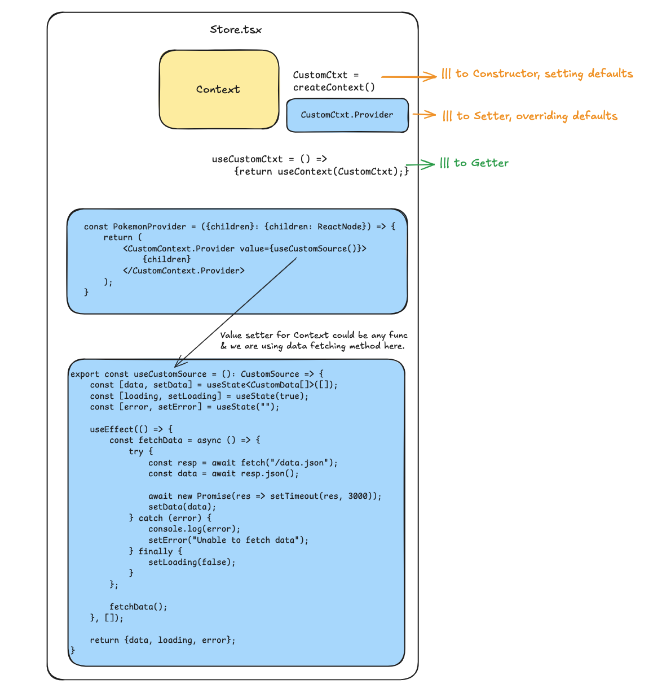

# React + TypeScript + Vite

This template provides a minimal setup to get React working in Vite with HMR and some ESLint rules.

Currently, two official plugins are available:

- [@vitejs/plugin-react](https://github.com/vitejs/vite-plugin-react/blob/main/packages/plugin-react) uses [Babel](https://babeljs.io/) for Fast Refresh
- [@vitejs/plugin-react-swc](https://github.com/vitejs/vite-plugin-react/blob/main/packages/plugin-react-swc) uses [SWC](https://swc.rs/) for Fast Refresh

## Expanding the ESLint configuration

If you are developing a production application, we recommend updating the configuration to enable type-aware lint rules:

```js
export default tseslint.config({
  extends: [
    // Remove ...tseslint.configs.recommended and replace with this
    ...tseslint.configs.recommendedTypeChecked,
    // Alternatively, use this for stricter rules
    ...tseslint.configs.strictTypeChecked,
    // Optionally, add this for stylistic rules
    ...tseslint.configs.stylisticTypeChecked,
  ],
  languageOptions: {
    // other options...
    parserOptions: {
      project: ['./tsconfig.node.json', './tsconfig.app.json'],
      tsconfigRootDir: import.meta.dirname,
    },
  },
})
```

You can also install [eslint-plugin-react-x](https://github.com/Rel1cx/eslint-react/tree/main/packages/plugins/eslint-plugin-react-x) and [eslint-plugin-react-dom](https://github.com/Rel1cx/eslint-react/tree/main/packages/plugins/eslint-plugin-react-dom) for React-specific lint rules:

```js
// eslint.config.js
import reactX from 'eslint-plugin-react-x'
import reactDom from 'eslint-plugin-react-dom'

export default tseslint.config({
  plugins: {
    // Add the react-x and react-dom plugins
    'react-x': reactX,
    'react-dom': reactDom,
  },
  rules: {
    // other rules...
    // Enable its recommended typescript rules
    ...reactX.configs['recommended-typescript'].rules,
    ...reactDom.configs.recommended.rules,
  },
})
```

## Overview of Context

* Create
* Update
* Use (Getter)
  



A comprehensive guide to understanding React Context for developers coming from OOP/Angular background.

---

## Table of Contents
1. [What is createContext()?](#1-what-is-createcontext)
2. [What is Context Provider?](#2-what-is-context-provider)
3. [Without vs With Provider Wrapper](#3-without-vs-with-provider-wrapper)
4. [Complete Example: Theme Context](#4-complete-example-theme-context)
5. [Advanced: Multiple Contexts Together](#5-advanced-multiple-contexts-together)
6. [OOP/Angular Parallels](#6-oopangular-parallels)

---

## 1. What is `createContext()`?

### Basic Usage

```javascript
import { createContext } from 'react';

const MyContext = createContext();
```

### What Does It Return?

When you call `createContext()`, it returns an **object** with two properties:

```javascript
const MyContext = createContext();

// MyContext is actually:
{
  Provider: ReactComponent,  // A special React component
  Consumer: ReactComponent   // Old way (before hooks, rarely used now)
}
```

### Why Do We Use `.Provider`?

The `Provider` component is React's built-in subscription/broadcasting mechanism. Think of it as:

- **`createContext()`** → Creates the communication channel (like defining a radio frequency)
- **`MyContext.Provider`** → The transmitter that broadcasts values (like the radio tower)
- **`useContext()`** → The receivers that listen for values (like radios tuning in)

```javascript
// MyContext.Provider is a component that:
// 1. Accepts a 'value' prop (what to broadcast)
// 2. Stores that value
// 3. Notifies all subscribers when value changes
// 4. Causes all consuming components to re-render

<MyContext.Provider value={{ data: 'something' }}>
  <App />  {/* Any child can access this value */}
</MyContext.Provider>
```

**Key Point**: The `Provider` component is just a "dumb" broadcaster. It doesn't have state or logic by itself. That's why we wrap it in our own component!

---

## 2. What is Context Provider?

A **Context Provider** is a custom wrapper component we create around `MyContext.Provider` to:
1. Add state management (`useState`, `useReducer`)
2. Add business logic (methods, computed values)
3. Provide a clean, reusable API

### Structure

```javascript
// Step 1: Create Context (the channel)
const MyContext = createContext();

// Step 2: Create Provider Wrapper (adds state + logic)
function MyContextProvider({ children }) {
  // State management
  const [state, setState] = useState(initialValue);
  
  // Business logic (methods)
  const someMethod = () => {
    // do something
    setState(newValue);
  };
  
  // Computed values
  const computedValue = useMemo(() => {
    return state * 2;
  }, [state]);
  
  // Public API - what consumers can access
  const value = {
    state,
    someMethod,
    computedValue
  };
  
  // Use Provider to broadcast
  return (
    <MyContext.Provider value={value}>
      {children}
    </MyContext.Provider>
  );
}

// Step 3: Custom hook for easy access (like Dependency Injection)
function useMyContext() {
  const context = useContext(MyContext);
  if (!context) {
    throw new Error('useMyContext must be used within MyContextProvider');
  }
  return context;
}
```

### OOP Analogy

```javascript
createContext()         // Class definition / Interface
    ↓
MyContext.Provider      // React's DI machinery (internal)
    ↓
MyContextProvider       // Service implementation with state + methods
    ↓
value prop              // Public API (getters + setters)
    ↓
useMyContext()          // Dependency Injection mechanism
```

---

## 3. Without vs With Provider Wrapper

### ❌ Without Wrapper (Not Recommended)

```javascript
const ThemeContext = createContext();

function App() {
  // Problem: State management happens in App component
  const [theme, setTheme] = useState('light');
  
  const toggleTheme = () => {
    setTheme(prev => prev === 'light' ? 'dark' : 'light');
  };
  
  return (
    <ThemeContext.Provider value={{ theme, toggleTheme }}>
      <Header />
      <Main />
      <Footer />
    </ThemeContext.Provider>
  );
}

function Header() {
  const { theme, toggleTheme } = useContext(ThemeContext);
  
  return (
    <header>
      <h1>My App</h1>
      <button onClick={toggleTheme}>
        Toggle Theme (Current: {theme})
      </button>
    </header>
  );
}
```

**Problems:**
- App component is cluttered with theme logic
- Can't reuse theme logic in other projects
- Hard to test in isolation
- State management mixed with UI structure

### ✅ With Wrapper (Best Practice)

```javascript
const ThemeContext = createContext();

// All theme logic encapsulated here
function ThemeProvider({ children }) {
  const [theme, setTheme] = useState('light');
  
  const toggleTheme = () => {
    setTheme(prev => prev === 'light' ? 'dark' : 'light');
  };
  
  // Could add more logic here
  const isDark = theme === 'dark';
  const colors = {
    background: theme === 'light' ? '#fff' : '#000',
    text: theme === 'light' ? '#000' : '#fff'
  };
  
  return (
    <ThemeContext.Provider value={{ theme, toggleTheme, isDark, colors }}>
      {children}
    </ThemeContext.Provider>
  );
}

// Custom hook with error handling
function useTheme() {
  const context = useContext(ThemeContext);
  if (!context) {
    throw new Error('useTheme must be used within ThemeProvider');
  }
  return context;
}

// Clean App component
function App() {
  return (
    <ThemeProvider>
      <Header />
      <Main />
      <Footer />
    </ThemeProvider>
  );
}

function Header() {
  const { theme, toggleTheme } = useTheme();
  
  return (
    <header>
      <h1>My App</h1>
      <button onClick={toggleTheme}>
        Toggle Theme (Current: {theme})
      </button>
    </header>
  );
}
```

**Benefits:**
- ✅ Clean separation of concerns
- ✅ Reusable across projects
- ✅ Easy to test
- ✅ App component stays clean
- ✅ All theme logic in one place

---

## 4. Complete Example: Theme Context

This example shows how multiple components at different levels can access and modify the theme without prop drilling.

```javascript
import React, { createContext, useContext, useState } from 'react';

// Step 1: Create the context (the "channel")
const ThemeContext = createContext();

// Step 2: Create the Provider wrapper (encapsulates state + logic)
function ThemeProvider({ children }) {
  const [theme, setTheme] = useState('light');
  
  const toggleTheme = () => {
    setTheme(prev => prev === 'light' ? 'dark' : 'light');
  };
  
  // Expose the public API
  return (
    <ThemeContext.Provider value={{ theme, toggleTheme }}>
      {children}
    </ThemeContext.Provider>
  );
}

// Step 3: Custom hook for easy access (DI mechanism)
function useTheme() {
  const context = useContext(ThemeContext);
  if (!context) {
    throw new Error('useTheme must be used within ThemeProvider');
  }
  return context;
}

// ============================================
// Components using the context
// ============================================

function App() {
  return (
    <ThemeProvider>
      <div style={{ minHeight: '100vh' }}>
        <Header />
        <Main />
        <Footer />
      </div>
    </ThemeProvider>
  );
}

function Header() {
  // Access theme context via custom hook
  const { theme, toggleTheme } = useTheme();
  
  return (
    <header style={{
      backgroundColor: theme === 'light' ? '#f0f0f0' : '#333',
      color: theme === 'light' ? '#000' : '#fff',
      padding: '20px',
      display: 'flex',
      justifyContent: 'space-between',
      alignItems: 'center'
    }}>
      <h1>My Awesome App</h1>
      
      {/* Button to toggle theme */}
      <button 
        onClick={toggleTheme}
        style={{
          padding: '10px 20px',
          backgroundColor: theme === 'light' ? '#007bff' : '#ffc107',
          color: theme === 'light' ? '#fff' : '#000',
          border: 'none',
          borderRadius: '5px',
          cursor: 'pointer',
          fontSize: '16px'
        }}
      >
        {theme === 'light' ? '🌙 Dark Mode' : '☀️ Light Mode'}
      </button>
      
      <Navigation />
    </header>
  );
}

function Navigation() {
  // Navigation also uses theme (no props needed!)
  const { theme } = useTheme();
  
  return (
    <nav>
      <ul style={{
        display: 'flex',
        gap: '20px',
        listStyle: 'none',
        margin: 0,
        padding: 0
      }}>
        <li><a href="#" style={{ color: theme === 'light' ? '#007bff' : '#ffc107' }}>Home</a></li>
        <li><a href="#" style={{ color: theme === 'light' ? '#007bff' : '#ffc107' }}>About</a></li>
        <li><a href="#" style={{ color: theme === 'light' ? '#007bff' : '#ffc107' }}>Contact</a></li>
      </ul>
    </nav>
  );
}

function Main() {
  const { theme } = useTheme();
  
  return (
    <main style={{
      backgroundColor: theme === 'light' ? '#ffffff' : '#1a1a1a',
      color: theme === 'light' ? '#000' : '#fff',
      padding: '40px',
      minHeight: '500px'
    }}>
      <h2>Welcome to the Main Content</h2>
      <p>This content automatically responds to theme changes!</p>
      
      <ProductCard />
      <SettingsPanel />
    </main>
  );
}

function ProductCard() {
  const { theme } = useTheme();
  
  return (
    <div style={{
      border: `1px solid ${theme === 'light' ? '#ddd' : '#555'}`,
      padding: '20px',
      margin: '20px 0',
      borderRadius: '8px',
      backgroundColor: theme === 'light' ? '#f9f9f9' : '#2a2a2a'
    }}>
      <h3>Product Title</h3>
      <p>Product description goes here...</p>
      <button style={{
        padding: '8px 16px',
        backgroundColor: theme === 'light' ? '#28a745' : '#4caf50',
        color: '#fff',
        border: 'none',
        borderRadius: '4px',
        cursor: 'pointer'
      }}>
        Add to Cart
      </button>
    </div>
  );
}

function SettingsPanel() {
  const { theme, toggleTheme } = useTheme();
  
  return (
    <div style={{
      border: `2px solid ${theme === 'light' ? '#007bff' : '#ffc107'}`,
      padding: '20px',
      margin: '20px 0',
      borderRadius: '8px'
    }}>
      <h3>Settings Panel</h3>
      <p>Current theme: <strong>{theme}</strong></p>
      
      {/* Another toggle button deep in the tree! */}
      <button 
        onClick={toggleTheme}
        style={{
          padding: '8px 16px',
          backgroundColor: theme === 'light' ? '#6c757d' : '#ffc107',
          color: theme === 'light' ? '#fff' : '#000',
          border: 'none',
          borderRadius: '4px',
          cursor: 'pointer'
        }}
      >
        Toggle Theme from Settings
      </button>
    </div>
  );
}

function Footer() {
  const { theme } = useTheme();
  
  return (
    <footer style={{
      backgroundColor: theme === 'light' ? '#e9ecef' : '#222',
      color: theme === 'light' ? '#000' : '#fff',
      padding: '20px',
      textAlign: 'center'
    }}>
      <p>&copy; 2024 My Awesome App. Current theme: {theme}</p>
    </footer>
  );
}

export default App;
```

### Key Points

1. **Single Source of Truth**: Theme state lives in `ThemeProvider` only
2. **No Prop Drilling**: Components at any level can access theme without passing props through every parent
3. **Multiple Access Points**: Both `Header` and `SettingsPanel` can toggle the theme
4. **Automatic Re-renders**: All components using `useTheme()` automatically re-render when theme changes

---

## 5. Advanced: Multiple Contexts Together

Real applications often need multiple contexts working together. Here's how to combine Theme and Auth contexts:

```javascript
import React, { createContext, useContext, useState } from 'react';

// ============================================
// Theme Context
// ============================================
const ThemeContext = createContext();

function ThemeProvider({ children }) {
  const [theme, setTheme] = useState('light');
  
  const toggleTheme = () => {
    setTheme(prev => prev === 'light' ? 'dark' : 'light');
  };
  
  return (
    <ThemeContext.Provider value={{ theme, toggleTheme }}>
      {children}
    </ThemeContext.Provider>
  );
}

function useTheme() {
  const context = useContext(ThemeContext);
  if (!context) {
    throw new Error('useTheme must be used within ThemeProvider');
  }
  return context;
}

// ============================================
// Auth Context
// ============================================
const AuthContext = createContext();

function AuthProvider({ children }) {
  const [user, setUser] = useState(null);
  const [isLoading, setIsLoading] = useState(false);
  
  const login = async (username, password) => {
    setIsLoading(true);
    try {
      // Simulate API call
      await new Promise(resolve => setTimeout(resolve, 1000));
      setUser({ 
        name: username, 
        id: Date.now(),
        email: `${username}@example.com`
      });
    } finally {
      setIsLoading(false);
    }
  };
  
  const logout = () => {
    setUser(null);
    // Could clear tokens, redirect, etc.
  };
  
  const isAuthenticated = !!user;
  
  return (
    <AuthContext.Provider value={{ 
      user, 
      login, 
      logout, 
      isAuthenticated,
      isLoading 
    }}>
      {children}
    </AuthContext.Provider>
  );
}

function useAuth() {
  const context = useContext(AuthContext);
  if (!context) {
    throw new Error('useAuth must be used within AuthProvider');
  }
  return context;
}

// ============================================
// App with Multiple Contexts
// ============================================
function App() {
  return (
    <AuthProvider>
      <ThemeProvider>
        <div style={{ minHeight: '100vh' }}>
          <Header />
          <Main />
        </div>
      </ThemeProvider>
    </AuthProvider>
  );
}

function Header() {
  // Using BOTH contexts simultaneously!
  const { theme, toggleTheme } = useTheme();
  const { user, logout, isAuthenticated } = useAuth();
  
  return (
    <header style={{
      backgroundColor: theme === 'light' ? '#f0f0f0' : '#333',
      color: theme === 'light' ? '#000' : '#fff',
      padding: '20px',
      display: 'flex',
      justifyContent: 'space-between',
      alignItems: 'center'
    }}>
      <h1>My Awesome App</h1>
      
      <div style={{ display: 'flex', gap: '10px', alignItems: 'center' }}>
        {/* Show user info if logged in */}
        {isAuthenticated && (
          <span>Welcome, <strong>{user.name}</strong>!</span>
        )}
        
        {/* Theme toggle button */}
        <button onClick={toggleTheme} style={{
          padding: '10px 20px',
          backgroundColor: theme === 'light' ? '#007bff' : '#ffc107',
          color: theme === 'light' ? '#fff' : '#000',
          border: 'none',
          borderRadius: '5px',
          cursor: 'pointer'
        }}>
          {theme === 'light' ? '🌙' : '☀️'}
        </button>
        
        {/* Conditional Login/Logout button */}
        {isAuthenticated ? (
          <button onClick={logout} style={{
            padding: '10px 20px',
            backgroundColor: '#dc3545',
            color: '#fff',
            border: 'none',
            borderRadius: '5px',
            cursor: 'pointer'
          }}>
            Logout
          </button>
        ) : null}
      </div>
    </header>
  );
}

function Main() {
  const { theme } = useTheme();
  const { isAuthenticated } = useAuth();
  
  return (
    <main style={{
      backgroundColor: theme === 'light' ? '#ffffff' : '#1a1a1a',
      color: theme === 'light' ? '#000' : '#fff',
      padding: '40px'
    }}>
      {isAuthenticated ? (
        <>
          <h2>Dashboard</h2>
          <Dashboard />
        </>
      ) : (
        <LoginForm />
      )}
    </main>
  );
}

function LoginForm() {
  const { theme } = useTheme();
  const { login, isLoading } = useAuth();
  const [username, setUsername] = useState('');
  const [password, setPassword] = useState('');
  
  const handleSubmit = (e) => {
    e.preventDefault();
    login(username, password);
  };
  
  return (
    <div style={{
      maxWidth: '400px',
      margin: '50px auto',
      padding: '30px',
      border: `1px solid ${theme === 'light' ? '#ddd' : '#555'}`,
      borderRadius: '8px',
      backgroundColor: theme === 'light' ? '#f9f9f9' : '#2a2a2a'
    }}>
      <h2>Login</h2>
      <form onSubmit={handleSubmit}>
        <div style={{ marginBottom: '15px' }}>
          <label style={{ display: 'block', marginBottom: '5px' }}>
            Username:
          </label>
          <input
            type="text"
            value={username}
            onChange={(e) => setUsername(e.target.value)}
            style={{
              width: '100%',
              padding: '8px',
              borderRadius: '4px',
              border: `1px solid ${theme === 'light' ? '#ccc' : '#555'}`,
              backgroundColor: theme === 'light' ? '#fff' : '#1a1a1a',
              color: theme === 'light' ? '#000' : '#fff'
            }}
            required
          />
        </div>
        <div style={{ marginBottom: '15px' }}>
          <label style={{ display: 'block', marginBottom: '5px' }}>
            Password:
          </label>
          <input
            type="password"
            value={password}
            onChange={(e) => setPassword(e.target.value)}
            style={{
              width: '100%',
              padding: '8px',
              borderRadius: '4px',
              border: `1px solid ${theme === 'light' ? '#ccc' : '#555'}`,
              backgroundColor: theme === 'light' ? '#fff' : '#1a1a1a',
              color: theme === 'light' ? '#000' : '#fff'
            }}
            required
          />
        </div>
        <button 
          type="submit" 
          disabled={isLoading}
          style={{
            width: '100%',
            padding: '10px',
            backgroundColor: isLoading ? '#6c757d' : '#28a745',
            color: '#fff',
            border: 'none',
            borderRadius: '4px',
            cursor: isLoading ? 'not-allowed' : 'pointer',
            fontSize: '16px'
          }}
        >
          {isLoading ? 'Logging in...' : 'Login'}
        </button>
      </form>
    </div>
  );
}

function Dashboard() {
  const { theme } = useTheme();
  const { user } = useAuth();
  
  return (
    <div>
      <p>You are logged in as <strong>{user.name}</strong></p>
      <p>Email: {user.email}</p>
      
      <ControlPanel />
    </div>
  );
}

function ControlPanel() {
  // This component is deeply nested but has access to EVERYTHING!
  const { theme, toggleTheme } = useTheme();
  const { user, logout } = useAuth();
  
  return (
    <div style={{
      border: `2px solid ${theme === 'light' ? '#007bff' : '#ffc107'}`,
      padding: '20px',
      borderRadius: '8px',
      marginTop: '20px'
    }}>
      <h3>Control Panel</h3>
      
      <div style={{ marginBottom: '15px' }}>
        <p><strong>Current Theme:</strong> {theme}</p>
        <p><strong>Logged in as:</strong> {user.name}</p>
      </div>
      
      <div style={{ display: 'flex', gap: '10px' }}>
        {/* Can toggle theme from anywhere! */}
        <button onClick={toggleTheme} style={{
          padding: '8px 16px',
          backgroundColor: theme === 'light' ? '#6c757d' : '#ffc107',
          color: theme === 'light' ? '#fff' : '#000',
          border: 'none',
          borderRadius: '4px',
          cursor: 'pointer'
        }}>
          Toggle Theme
        </button>
        
        {/* Can logout from anywhere! */}
        <button onClick={logout} style={{
          padding: '8px 16px',
          backgroundColor: '#dc3545',
          color: '#fff',
          border: 'none',
          borderRadius: '4px',
          cursor: 'pointer'
        }}>
          Logout
        </button>
      </div>
    </div>
  );
}

export default App;
```

### Key Concepts in Multiple Contexts

1. **Context Composition**: Wrap providers in a nested structure
   ```javascript
   <AuthProvider>
     <ThemeProvider>
       <App />
     </ThemeProvider>
   </AuthProvider>
   ```

2. **Independent but Complementary**: Each context manages its own state independently
   - `AuthProvider` handles user authentication
   - `ThemeProvider` handles UI theme
   - Components can use one, both, or neither

3. **Deep Access**: The `ControlPanel` component (deeply nested) can access and modify both contexts without any prop drilling

4. **Real-World Pattern**: This mirrors how real applications work - multiple concerns (auth, theme, cart, notifications) each with their own context

---

## 6. OOP/Angular Parallels

For developers coming from Angular or OOP background:

### Comparison Table

| React Context | Angular / OOP |
|---------------|---------------|
| `createContext()` | Class definition / Interface / `InjectionToken` |
| `MyContext.Provider` | Angular's DI system (internal machinery) |
| `MyContextProvider` | `@Injectable` Service class |
| `value` prop | Public API (methods + properties) |
| `useContext()` / custom hook | Dependency Injection via constructor |

### Side-by-Side Example

**Angular Service:**
```typescript
@Injectable({ providedIn: 'root' })
export class ThemeService {
  private theme = new BehaviorSubject('light');
  theme$ = this.theme.asObservable();
  
  toggleTheme() {
    const newTheme = this.theme.value === 'light' ? 'dark' : 'light';
    this.theme.next(newTheme);
  }
}

@Component({...})
export class HeaderComponent {
  constructor(public themeService: ThemeService) {}
  
  toggle() {
    this.themeService.toggleTheme();
  }
}
```

**React Context (Equivalent):**
```javascript
const ThemeContext = createContext();

function ThemeProvider({ children }) {
  const [theme, setTheme] = useState('light');
  
  const toggleTheme = () => {
    setTheme(prev => prev === 'light' ? 'dark' : 'light');
  };
  
  return (
    <ThemeContext.Provider value={{ theme, toggleTheme }}>
      {children}
    </ThemeContext.Provider>
  );
}

function Header() {
  const themeService = useTheme();  // Like DI!
  
  const toggle = () => {
    themeService.toggleTheme();
  };
  
  return <button onClick={toggle}>Toggle</button>;
}
```

### Mental Model Summary

```
createContext()         // interface ThemeService { ... }
    ↓
MyContext.Provider      // Angular's DI machinery (you don't see this)
    ↓
MyContextProvider       // @Injectable() class ThemeService { ... }
    ↓
value prop              // public methods and properties
    ↓
useMyContext()          // constructor(private themeService: ThemeService)
```

---

## Best Practices

1. **Always create a custom hook** - Provides better error messages and cleaner API
   ```javascript
   function useTheme() {
     const context = useContext(ThemeContext);
     if (!context) {
       throw new Error('useTheme must be used within ThemeProvider');
     }
     return context;
   }
   ```

2. **Keep contexts focused** - One context per concern (Theme, Auth, Cart, etc.)

3. **Memoize expensive values** - Use `useMemo` for computed values
   ```javascript
   const value = useMemo(() => ({
     theme,
     toggleTheme,
     isDark: theme === 'dark'
   }), [theme]);
   ```

4. **Don't overuse Context** - For props going 1-2 levels deep, just use props

5. **Consider performance** - Context updates re-render all consumers. For high-frequency updates, consider state management libraries (Redux, Zustand)

---

## When to Use Context?

✅ **Good for:**
- Theme (dark/light mode)
- User authentication
- Language/localization
- Shopping cart
- Global settings
- Current user preferences

❌ **Avoid for:**
- Frequently changing data (use state management like Redux)
- Props that only go 1-2 levels deep (just use regular props)
- Performance-critical data that updates rapidly

---

## Conclusion

React Context is essentially **Dependency Injection for React**. It allows you to:
- Share data across the component tree
- Avoid prop drilling
- Encapsulate logic in reusable providers
- Build scalable applications with clean architecture

Think of Context as broadcasting data to all interested components, rather than passing messages person-by-person through props!

---

**Happy Coding! 🚀**
